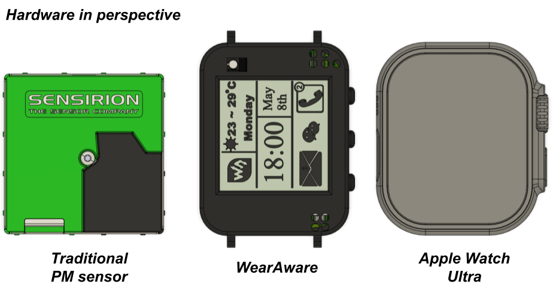
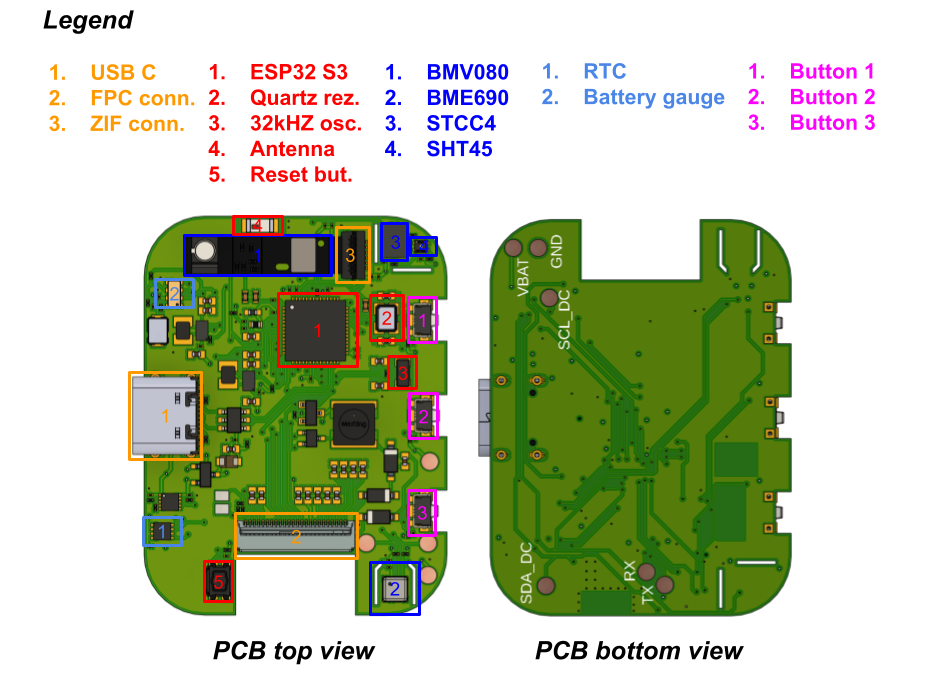

# WearAware

WearAware is an open-source wearable air-quality monitoring device designed to provide compact, low-power environmental sensing in a smartwatch-sized form factor.

The device is based on the ESP32-S3 and integrates multiple environmental sensors to measure particulate matter, CO$_2$, temperature, humidity, pressure, and related environmental parameters. Measurements can be transmitted wirelessly using Bluetooth Low Energy (BLE) and displayed locally on the integrated e-paper display.

## Hardware overview

WearAware combines the following main components:

- ESP32-S3 microcontroller
- Bosch BMV080 particulate matter sensor
- Bosch BME690 environmental sensor
- Sensirion STCC4 CO$_2$ sensor
- Sensirion SHT45 temperature and humidity sensor
- RTC
- Battery fuel gauge
- E-paper display
- USB-C interface
- Physical control buttons

The main PCB components and their locations are shown below.

## Firmware

The firmware is developed using [PlatformIO](https://platformio.org/) and contains all files required to compile, upload, and run the current WearAware firmware.

The current implementation focuses on keeping the code simple and easy to understand, while providing the core functionality required to operate the hardware. This includes:

- Sensor initialization and data acquisition
- Power management and sensor duty cycling
- Bluetooth Low Energy communication
- Battery monitoring
- E-paper display control
- Low-power operation using the ESP32-S3 power-management features

The firmware is intended to provide a clear starting point for understanding the hardware and for developing more advanced applications based on the WearAware platform.

## Getting started

1. Install [Visual Studio Code](https://code.visualstudio.com/).
2. Install the PlatformIO extension.
3. Clone this repository.
4. Open the project directory in PlatformIO.
5. Connect the WearAware device through USB-C.
6. Build and upload the firmware.

Further documentation on firmware structure, BLE characteristics, hardware setup, and operation will be added as the project develops.

## Repository structure

The repository contains the PlatformIO project files required to build and program the WearAware device, together with the corresponding source code and configuration files.

## License

Hardware and software licensing information is provided in the repository.
